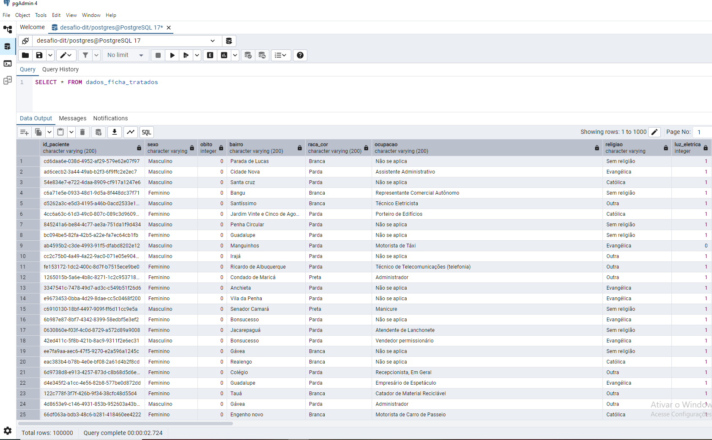

# Desafio Técnico DIT para Cientista de Dados

## Bem-vindo!

Neste repositório, é apresentado todo o pipeline de desenvolvimento do desafio técnico proposto para a vaga de Cientista de Dados DIT.

O desenvolvimento consistiu nas seguintes etapas:

## 1. Configuração do DBT local com VSCode

O primeiro passo do projeto foi realizar a configuração do DBT (Data Build Tool) localmente, seguindo um passo a passo para posteriormente desenvolver o modelo que trata os dados brutos em uma nova tabela transformada. Foi criado um ambiente virtual chamado `dbt_venv` para inicializar a configuração do DBT e utilizá-lo conforme necessário (como realizar as transformações em modelo DBT, que é o caso desse desafio).

O projeto DBT pode ser encontrado na pasta **desafio_dit**.

## 2. Análise Exploratória dos Dados

Essa etapa consistiu em analisar o conjunto de dados brutos disponibilizado no arquivo **dados_ficha_a_desafio.csv**, com informações descritivas presentes em **descricao_de_campos.xlsx**. O objetivo foi compreender a estrutura dos dados, identificar possíveis inconsistências e sugerir melhorias na qualidade da informação. Além disso, foi necessário interpretar o contexto de geração dos dados, levantar questionamentos e apontar problemas que poderiam impactar análises futuras.

Todo o processo pode ser visto no arquivo **eda_pré.ipynb**, no qual foi realizada a análise exploratória dos dados em formato de relatório.

## 3. Criação do Modelo DBT

Essa etapa envolveu o tratamento dos dados brutos analisados acima por meio de um modelo DBT escrito em SQL, resultando em uma nova tabela tratada no PostgreSQL. O objetivo foi desenvolver um modelo que padronizasse e estruturasse os dados, garantindo maior qualidade e consistência. O foco esteve na criação de um pipeline modularizado e legível, facilitando a manutenção e escalabilidade do processo.

O modelo pode ser encontrado em **`/desafio-dit/models/dados_ficha_tratados.sql`**, onde foi estruturado um pipeline fluido e organizado com CTE's (Common Table Expressions).

Para criar a tabela tratada no Pgadmin, utilizei o comando: ´dbt run´. 

## 4. Resultados

Para ver os resultados, foi possível realizar uma query básica para olhar os dados da nova tabela criada com o nome atribuito na modelagem DBT **dados_ficha_tratados**.

Como foi feito de forma local, gerei um csv dessa nova tabela tratada e coloquei no arquivo **dados_ficha_tratados.csv**. Os valores únicos de cada coluna tratada foram mostrados no arquivo **eda_pós.ipynb**.

### **Transformações analisadas e realizadas em modelo DBT:**

- **`obito, luz_eletrica, em_situacao_de_rua, possui_plano_saude, vulnerabilidade_social, familia_beneficiaria_auxilio_brasil, crianca_matriculada_creche_pre_escola`**: Essas colunas possuem valores misturados entre `0, 1, False e True`. Portanto, foram transformadas para conter apenas `0 (False)` e `1 (True)`.

- **`sexo`**: Foi necessário traduzir para português. Sugere-se que, no ato da coleta, as opções estejam disponíveis em português.

- **`religiao`**: Apresentava algumas religiões válidas, mas também continha valores inconsistentes, como `'ESB ALMIRANTE'`, `'10 EAP 01'` e `'Acomp. Cresc. e Desenv. da Criança'`, que não fizeram sentido para esse campo e foram removidos, considerando apenas religiões válidas.

    Além disso, `'Sim'` e `'Não'` são respostas que podem gerar ambiguidade. Recomenda-se remover essas opções dos questionários, pois já existem respostas específicas para religião ou para "Sem religião". No entanto, mantive `'Sim'` e `'Não'`, pois ainda são respostas, e qualquer ajuste precisaria ser discutido com a área de negócios.

- **`renda_familiar`**: Alguns valores estavam incorretos, como `'Manhã'` e `'Internet'`, os quais removi, considerando apenas valores de renda familiar válidos.

- **`identidade_genero`**: Essa variável possui informações coletadas que são delicadas e apresentam alguns erros relevantes. Algumas opções, como `'Heterossexual'`, `'Homossexual (gay/lésbica)'` e `'Bissexual'`, referem-se à **orientação sexual** e não à identidade de gênero. Assim, essas opções foram removidas do campo e foi considerado apenas valores de identidade de gênero válidos.  

    Além disso, `'Sim'` e `'Não'` apresentaram o mesmo problema observado na coluna de religião, mas também os mantive e recomendo remover dos questionários. Já o valor nulo presente sugere ser um campo não preenchido, sendo ideal que o formulário tenha uma opção como `'Prefiro não responder'`, mas que seja de preenchimento obrigatório, para evitar valores nulos. Além disso, substitui `'Homem transexual'` e `'Mulher transexual'` por `'Trans'`, evitando redundância com o campo de `sexo` e também sugiro haver essa alteração no formulário.

- **`situacao_profissional`**: O campo possui valores corretos, exceto por entradas erradas como `'SMS CAPS DIRCINHA E LINDA BATISTA AP 33'` e `'Médico Urologista'`, os quais removi, considerando apenas valores de situação profissional válidos.

    Além disso, `'Não trabalha'` e `'Desempregado'` foram mantidos, pois podem representar situações diferentes (quem não tem idade para trabalhar e quem está sem emprego, respectivamente). Já o valor `'Não se aplica'` é ambíguo, pois pode significar tanto "não pode trabalhar" quanto "desempregado", então sugiro reavaliá-lo no formulário junto da área de negócio sobre removê-lo.

- **`meios_transporte, doencas_condicoes, meios_comunicacao, em_caso_doenca_procura`**: Essas colunas possuem valores provavelmente vindos de checkboxes de múltipla seleção, exigindo tratamento para remover caracteres desnecessários como colchetes, aspas e erros de parser.  

    Especificamente, os campos **`meios_comunicacao`** e **`em_caso_doenca_procura`** apresentaram valores que não pertencem a essas colunas , os quais foram removidos, considerando apenas valores válidos nesses campos.

O restante das colunas pareceram estar corretos, apesar de que algumas possuem informações que poderiam ser ajustadas, mas exigiriam alinhamento com os envolvidos no negócio. De qualquer forma, eu dissertei sobre elas ao longo do relatório no arquivo **eda_pré.ipynb**.

Para qualquer dúvida, pode enviar um e-mail para: matheusmelo1702@gmail.com.
